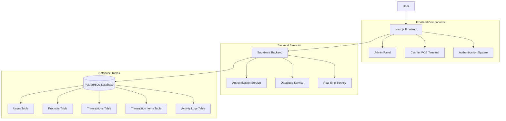
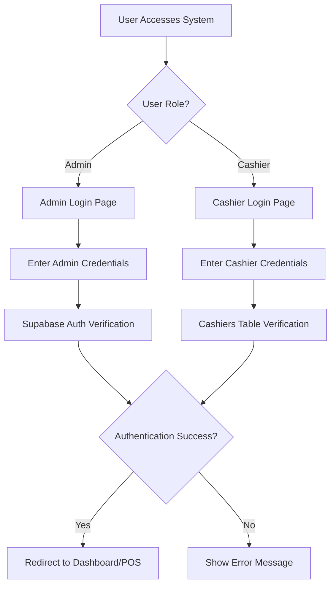
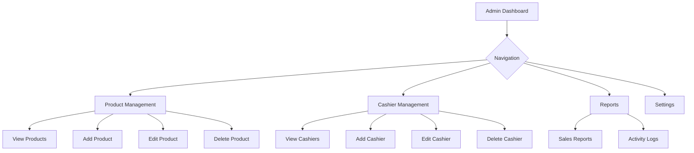
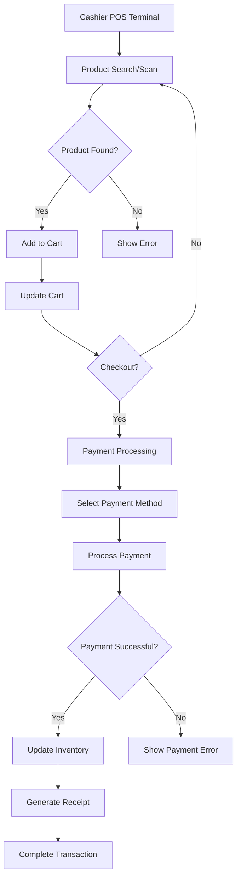
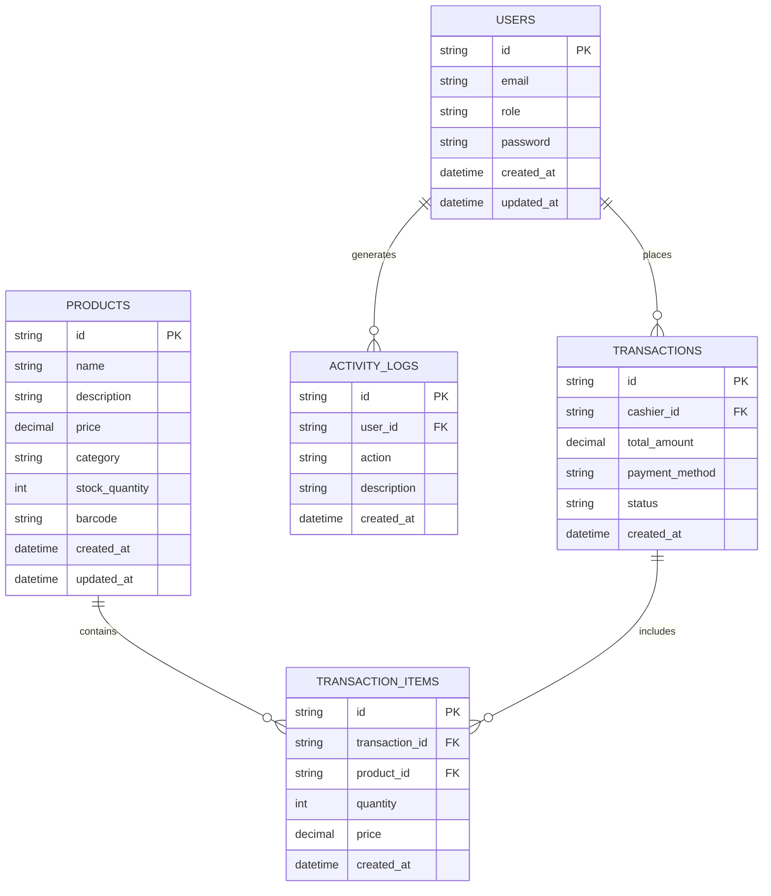

# POS System Workflow

This document provides a comprehensive overview of the POS system workflow, showing how different components interact with each other.

## System Architecture Overview

## User Authentication Flow

## Admin Panel Workflow

## Cashier POS Terminal Workflow

## Database Schema Relationships

## Key System Features

### Authentication & Authorization
- Role-based access control (Admin/Cashier)
- Secure authentication with Supabase Auth
- Session management for both user types

### Admin Features
- Dashboard with analytics overview
- Product Management (CRUD operations)
- Cashier Management (view/add/edit/delete)
- Reports section (sales reports, activity logs)
- Settings panel

### Cashier Features
- Main POS interface with product grid/search
- Shopping cart functionality
- Barcode scanning integration
- Payment processing workflow
- Receipt generation and printing
- Real-time inventory updates

### Data Management
- PostgreSQL database with proper schema
- Row Level Security (RLS) policies
- Real-time data synchronization
- Activity logging for audit trails

## Data Flow Process

1. **User Authentication**
   - Users access login pages based on their role
   - Credentials verified against database
   - Session created upon successful authentication

2. **Admin Operations**
   - Admins can manage products, cashiers, and view reports
   - All changes are logged in activity logs
   - Real-time updates propagate to all connected clients

3. **POS Operations**
   - Cashiers search for products or scan barcodes
   - Items added to cart with quantity selection
   - Payment processed through selected method
   - Inventory automatically updated after transaction
   - Transaction recorded in database with timestamp

4. **Reporting & Analytics**
   - Sales data aggregated from transactions
   - Activity logs track all user actions
   - Reports generated based on date ranges
   - Real-time dashboard updates for admin overview

This workflow ensures a smooth, secure, and efficient operation of the POS system for both administrators and cashiers.