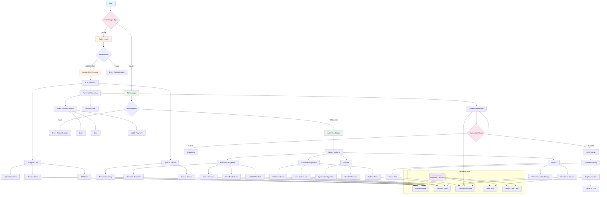

# AJ Softdrive POS System - Workflow Diagram

This document provides a comprehensive workflow diagram for the AJ Softdrive Point of Sale system, showing how different components and user roles interact within the system.

## System Components Overview

### 1. User Access Points
- **Public Landing Page**: Entry point for all users
- **Admin Login**: Secure authentication for administrative functions
- **Cashier Login**: Authentication for POS terminal access

### 2. Admin Dashboard
The admin dashboard provides comprehensive system management capabilities:
- **Product Management**: Add, edit, delete, and manage product inventory
- **Cashier Management**: Create and manage cashier accounts
- **Reports**: View sales data, transaction history, and performance metrics
- **Settings**: Configure system preferences and user settings

### 3. Cashier POS Terminal
The POS terminal is designed for efficient transaction processing:
- **Product Search**: Manual search or barcode scanning
- **Shopping Cart**: Add/remove items and adjust quantities
- **Payment Processing**: Multiple payment methods (cash, card, mobile)
- **Receipt Generation**: Print or email transaction receipts
- **Inventory Updates**: Real-time stock adjustments

### 4. Database Layer
All system data is managed through Supabase:
- **Products Table**: Product information, pricing, and inventory
- **Cashiers Table**: Cashier account information and credentials
- **Transactions Table**: Sales records and payment details
- **Users Table**: Admin user accounts and roles
- **Activity Logs Table**: System events and user actions

## Key Workflows

### Authentication Flow
1. User selects login type (Admin or Cashier)
2. System validates credentials against appropriate database table
3. Successful authentication grants access to respective dashboard
4. Failed authentication returns user to login with error message

### Product Management Flow
1. Admin navigates to Product Management section
2. Admin can add new products or edit existing ones
3. System updates Products table in database
4. Changes are immediately reflected in POS terminal

### Transaction Processing Flow
1. Cashier scans or searches for products
2. Items are added to shopping cart
3. Customer selects payment method
4. System processes payment and creates transaction record
5. Inventory is automatically updated
6. Receipt is generated and printed

### Reporting Flow
1. Admin navigates to Reports section
2. System queries Transactions table for relevant data
3. Data is aggregated and displayed in dashboard
4. Admin can filter by date range and export data

This workflow diagram provides a comprehensive overview of how the AJ Softdrive POS system operates, showing the relationships between different components and user roles.