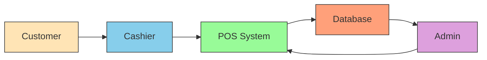

# Simple POS System Workflow

This diagram shows the basic workflow of the POS system with interactions between customers, cashiers, and administrators.

## Workflow Steps

1. **Customer → Cashier**: Customer brings items for purchase
2. **Cashier → POS System**: Cashier processes items and payments
3. **POS System → Database**: Sales data is stored in database
4. **Database → Admin**: Admin views reports and analytics
5. **Admin → POS System**: Admin manages products and cashiers

This simple flow shows how data moves through the system from customer purchase to administrative oversight.