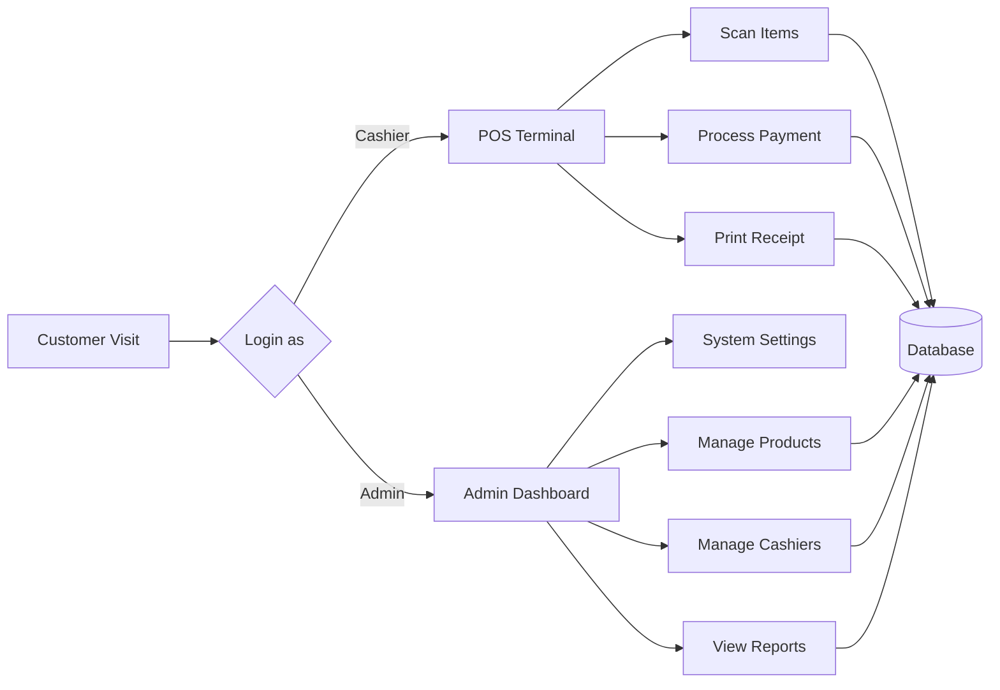

## Core User Journeys

### 1. Administrator Workflow
- **Login** to admin panel
- **Manage Products**: Add, edit, or remove items from inventory
- **Manage Cashiers**: Create or delete cashier accounts
- **View Reports**: Check sales data and transaction history
- **Adjust Settings**: Configure system preferences

### 2. Cashier Workflow
- **Login** to POS terminal
- **Scan Items** or search products manually
- **Process Payment** using cash, card, or mobile payment
- **Print Receipt** for customer
- **Complete Transaction** and update inventory automatically

Both workflows interact with the central **Database** which stores all product, transaction, and user information.