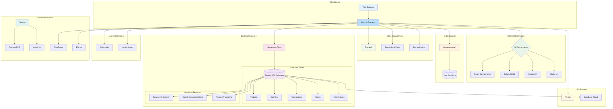

# AJ Softdrive POS System - Technical Architecture

This document provides a detailed technical architecture diagram for the AJ Softdrive Point of Sale system, showing the technology stack and component interactions.

## Technology Stack Breakdown

### Frontend Technologies
- **Next.js**: React framework with App Router for server-side rendering
- **React 18**: UI library for building interactive components
- **TypeScript**: Type-safe JavaScript for better code quality
- **Tailwind CSS**: Utility-first CSS framework for styling
- **Shadcn UI/Radix UI**: Accessible UI component library

### State Management & Validation
- **Zustand**: Lightweight state management solution
- **React Hook Form**: Performant, flexible forms with easy validation
- **Zod**: TypeScript-first schema declaration and validation library

### Backend & Database
- **Supabase**: Open source Firebase alternative
  - **PostgreSQL**: Relational database for data storage
  - **Supabase Auth**: Authentication and user management
  - **Row Level Security**: Fine-grained access control
  - **Real-time**: Live updates to connected clients

### Development & Testing
- **Cypress**: End-to-end testing framework
- **Jest**: JavaScript testing framework for unit tests
- **ESLint**: Code linting for consistency and error prevention

### External Libraries
- **JsBarcode**: Barcode generation library
- **Lucide Icons**: Beautiful and consistent icon set

### Deployment Infrastructure
- **Vercel**: Hosting platform optimized for Next.js applications
- **Supabase Cloud**: Managed backend-as-a-service platform

## Data Flow

1. **User Interface**: Next.js renders React components with Tailwind styling
2. **State Management**: Zustand manages global application state
3. **Form Handling**: React Hook Form with Zod validation processes user inputs
4. **Authentication**: Supabase Auth handles user login and session management
5. **API Requests**: Supabase client communicates with PostgreSQL database
6. **Database Operations**: Row Level Security policies enforce data access rules
7. **Real-time Updates**: Database changes are instantly reflected in UI
8. **External Services**: JsBarcode generates product barcodes for printing

This architecture enables a modern, scalable, and secure POS system with real-time capabilities and a responsive user interface.